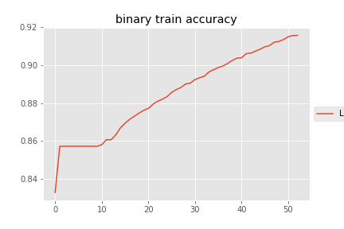
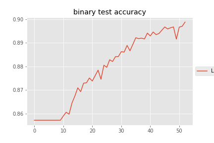

name: inverse
layout: true
class: center, middle, inverse

---

# 自然言語処理の 機械学習モデル開発
体言止めの文章にふさわしい語尾の推測

---
layout:false
## 自己紹介

<dl>
  <dt>名前</dt>
  <dd>岩佐　拓哉</dd>
  <dt>所属</dt>
  <dd>デンソー</dd>
  <dt>担当業務</dt>
  <dd>対話システムの開発　→　scrumによる車載器の先行開発</dd>
  <dt>得意言語</dt>
  <dd>python</dd>
<dl>

---

# 体言止めとは？

体言止めとは、和歌・俳諧などで、語尾を名詞・代名詞などで止める使い方のこと。

例

`
5点リードの9回に一塁の守備に就くと、2死一塁で平沼のライナーをダイビングキャッチ。
`

5点リードの9回に一塁の守備に就くと、2死一塁で平沼のライナーをダイビングキャッチした

---

# なぜ体言止めの語尾を予測するか

- 体言止めは、書き言葉には多用されるが、話し言葉ではほとんど使われない

- 書き言葉で書かれたニュース文を、対話システムの発話文として使うときに、話し言葉に変換したい

- 書き言葉にしか現れない体言止めを通常の文章に戻しておきたい

---

# 解決方法の検討

## 既存手法で解決できそうか？
形態素を手がかりに予測　→　時勢を当てられないため、精度がでない

## 機械学習で解決できそうか？

語尾は有限なので、分類問題に落とし込めそう

トレーニングデータは無いが、機械的に作れそう
→　自分でデータを作って機械学習

---

# モデルの作り方

1. データを作る
2. 予測モデルを作る
3. 評価する

---

# データを作る

正攻法 : お金をかけてデータ作成会社に発注する

今回：体言止めでは無い文章から**機械的に**作れたので、自分で作る

`ボールをキャッチした` →　`ボールをキャッチ` + `した`

---

# 予測モデルを作る

自然言語は**時系列情報**なので、RNN（LSTM）でモデルを作る

---

# 自然言語は時系列データ

## ばか

## かば

自然言語の文字列が表す意味は、文字の種類と**順番**とその他の情報によって決まる

---

# 評価する

|train|test|
|:--:|:--:|
|||

### 精度を上げるためには

- クロスバリデーションする
- 文字列入力の方法を工夫する
- 層数を増やす
...etc

<!--  -->

---

# まとめ

- 手法として機械学習を選ぶときはデータがあるか？をまず考える
- データがなければ自分で作れるか？or予算があるか？を考える
- 自然言語は時系列情報
- LSTMは強力
